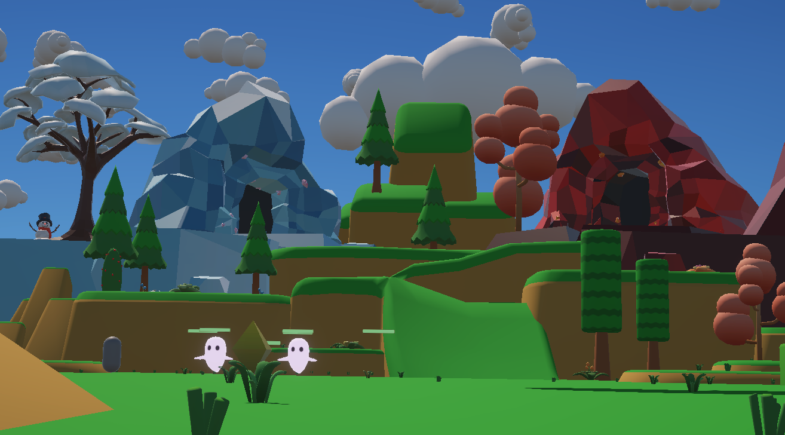
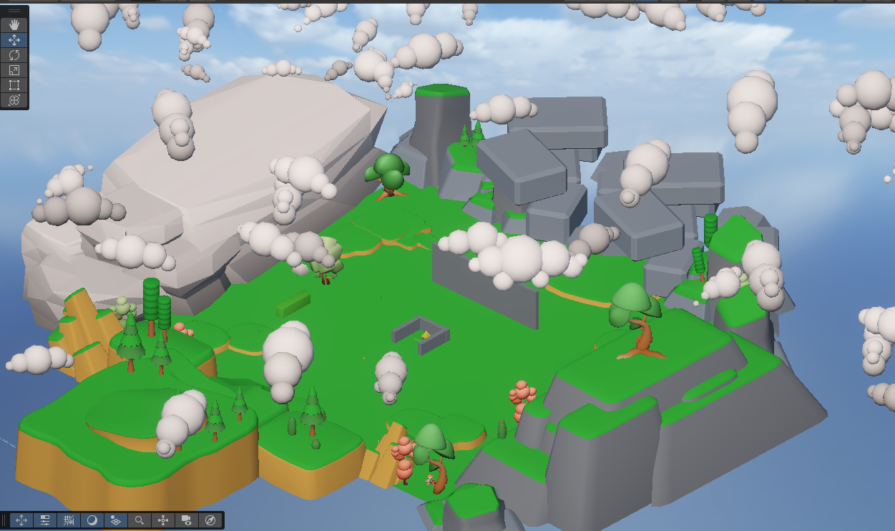
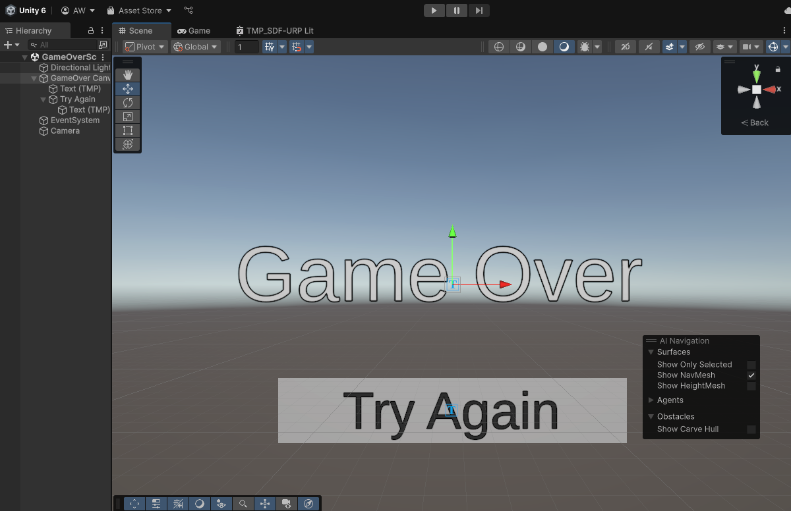
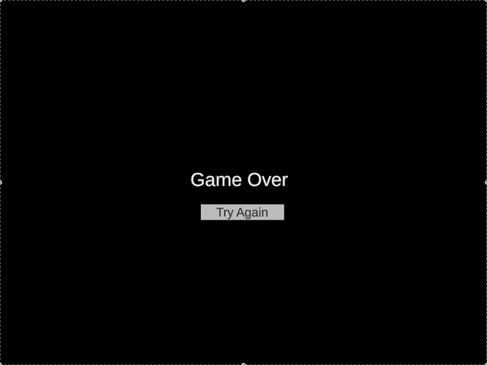

# Ghoul Rush - Highlights (CART 315, Winter 2025)

Unity horde defense prototype built by a 2-person team.
I focused on shipping a playable core loop (waves, combat, health, UI, upgrades), level design, and polish into a build.

## Start Here
- Final project journal (Weeks 7-12): [Process/GhoulRush_Journal.md](Process/GhoulRush_Journal.md)
- Team repo: https://github.com/Noe235/CART315FinalProject
- Media: [Process/Images/FinalProject](Process/Images/FinalProject)

## What I Contributed
- Enemy AI + damage targeting (player vs core)
- Universal health + world-space health bars
- Wave spawner with scaling difficulty + inter-wave pacing
- Game Over scene + restart loop
- HUD messaging (countdowns, pickups, alerts)
- Asset integration + URP conversion workflow + level layout iteration
- Build prep (scenes in build, resolution/UI fixes, SFX pass)

## Demos

### Health Bars

### Implementing Ghost Horde

### Level Design

### Game Over flow

Game Over triggering in gameplay

